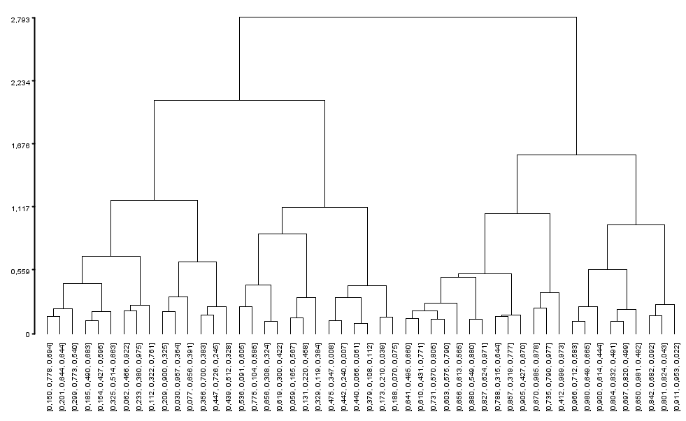

# YACL

Yet Another <u>Clustering</u> Library (written in Java).

## Features (and future)

Clustering methods and features:

- [X] Hierarchical (agglomerative):
  - *Single*, *Complete*, *Average*, *Weighted* and *Ward* linkages (monotonic);
  - Dendogram visualization (see examples below);
  - Cluster extraction from dendogram cut;
- [X] Partitioning:
  - K-Means++;
- [ ] Density-based:
  - DBSCAN;
  - OPTICS;
- [ ] ...

The clustering methods can utilize any *distance metric* that implements the `Distance` interface, altough some care must
be taken with specific methods, namely:

- :warning: The *Ward* linkage produces valid results only for *Euclidean* distances;

:bulb: If you are interested in *neural models* for clustering, check out the [Ubiquitous Neural Networks](https://github.com/brunomnsilva/UbiquitousNeuralNetworks) library.

## Documentation

### Installation

Binaries and dependency information for Maven, Gradle and others can be found at [http://search.maven.org](https://central.sonatype.com/search?q=g%3Acom.brunomnsilva++a%3Ayacl&smo=true).

Example for Maven:

```xml
<dependency>
    <groupId>com.brunomnsilva</groupId>
    <artifactId>yacl</artifactId>
    <version>x.y.z</version>
</dependency>
```

You need Java 9 or later.

There are no external transient dependencies.

### API Reference

[](https://javadoc.io/doc/com.brunomnsilva/yacl)

### Usage and Examples

#### `Clusterable` *interface*

Items to be clustered must implement the `Clusterable` interface:

```java
public interface Clusterable<T> {

    /**
     * Calculates the distance (similarity) between this object and the specified other object.
     * <br/>
     * It is expected that the distance be always <code>&ge; 0</code>.
     * <br/>
     * This method must be implemented when working with clustering procedures that operate
     * over distance matrices, e.g., hierarchical clustering.
     *
     * @param other the other object to calculate the distance to
     * @return the distance between this object and the other object
     */
    double clusterableDistance(T other);

    /**
     * Returns the spatial coordinates of the clusterable.
     * <br/>
     * This method must be implemented when working with clustering procedures that operate
     * over data points, e.g., k-means clustering.
     *
     * @return the spatial coordinates of the clusterable
     */
    double[] clusterablePoint();

    /**
     * Returns the label of the clusterable.
     * <br/>
     * This label may be used to label dendogram leaves and when printing cluster members.
     *
     * @return the label of the clusterable
     */
    String clusterableLabel();
}
```

:bulb: Notes:

- `clusterableDistance` - This allows some versatility over the items to be clustered and the clustering method, e.g., we can 
perform *hierarchical clustering* over items that do not have a spatial representation (vector), as 
long as we provide some way of computing a distance between items. 
  - For example, I have a personal necessity to cluster *component planes* (which are essentially matrices) of Self-Organizing Maps. The way distances are
computed between these component planes is not as straightforward as a distance between n-dimensional vectors.
- `clusterableLabel` - This allows to determine which text representation is used to identify a clusterable item in, e.g., visualization of dendograms and cluster members.

#### Creating some data

Let's cluster some vectors! 

As we must implement the `Clusterable` interface, we must create a *wrapper* class
to cluster them. We can do this, for example, as:

```java
public static class MyVectorN implements Clusterable<MyVectorN> {
    private double[] vector;

    public MyVectorN(double[] vector) {
        this.vector = vector;
    }

    public MyVectorN(int dimension, Random rnd) {
        this.vector = new double[dimension];
        for(int i=0; i < dimension; ++i) {
            vector[i] = rnd.nextDouble();
        }
    }

    @Override
    public double clusterableDistance(MyVectorN other) {
        // Euclidean distance
        double sum = 0.0;
        for (int i = 0; i < vector.length; ++i) {
            double diff = vector[i] - other.vector[i];
            sum += diff * diff;
        }
        return Math.sqrt(sum);
    }

    @Override
    public double[] clusterablePoint() {
        return vector;
    }

    @Override
    public String clusterableLabel() {
        // This "shortens" the vector components to 3 decimal places
        return ArrayUtils.toString(vector, 3);
    }
}
```

With this `MyVector` type in place, we can create some random vectors to cluster:

```java
// specify 'seed' for reproducible results in this tutorial
Random rnd = new Random(667); 

int numSamples = 50;
List<MyVectorN> samples = new ArrayList<>();
for (int i=0; i < numSamples; ++i) {
    samples.add(new MyVectorN(3, rnd));
}
```

:bulb: Note that you can instead *wrap* your imported data into instances of this class.

#### Hierarchical clustering

Lets perform some hierarchical (agglomerative) clustering on our data, using the *Ward* linkage:

```java
// Hierarchical clustering usage
HierarchicalClustering<MyVectorN> hclust = new HierarchicalClustering<>("ward");
HierarchicalClusteringResult<MyVectorN> hclustResult = hclust.cluster(samples);
```

##### Visualizing the dendogram

Dendogram visualization and inspection is one way of determining the best cluster structure with hierarchical clustering.
We can visualize the dendogram with:

```java
Dendogram<MyVectorN> dendogram = new Dendogram<>(hclustResult);
DendogramVisualization<MyVectorN> viz = new DendogramVisualization<>(dendogram, DendogramVisualization.LabelType.LABEL);

JFrame frame = new JFrame("Dendrogram Graph");
frame.setDefaultCloseOperation(JFrame.EXIT_ON_CLOSE);
frame.add(viz);
frame.setSize(1000, 800);
frame.setLocationRelativeTo(null); // Center window
frame.setVisible(true);
```

This results in the following dendogram depiction:



> :bulb: The decision of the number of clusters that can best depict different groups
> can be chosen by observing the dendogram. The best choice is the number of vertical
> lines in the dendogram cut by a horizontal line that can transverse the maximum distance
> vertically without intersecting a cluster.

In the above dendogram we can derive the choice of 2 clusters.

##### Hierarchical cluster extraction

Example of extracting 2 clusters from a hierarchical clustering procedure,

```java
List<Cluster<MyVectorN>> clusters = DendogramCut.byNumberOfClusters(hclustResult, 2);
for (Cluster<MyVectorN> cluster : clusters) {
    System.out.println(cluster);
}
```
The cluster extraction procedure returns a list of `Cluster<MyVector>` instances, where each cluster
contains the clustered members. The output of the previous code is the following:

```console
Cluster Id = 97
Members (28) = {
	[0,150, 0,778, 0,694]
	[0,201, 0,644, 0,644]
	[0,299, 0,773, 0,540]
	[0,185, 0,490, 0,683]
	[0,154, 0,427, 0,595]
	[0,325, 0,514, 0,663]
	[0,062, 0,466, 0,922]
	[0,233, 0,380, 0,975]
	[0,112, 0,322, 0,761]
	[0,209, 0,900, 0,325]
	[0,030, 0,957, 0,364]
	[0,077, 0,656, 0,391]
	[0,356, 0,700, 0,383]
	[0,447, 0,726, 0,245]
	[0,439, 0,512, 0,328]
	[0,536, 0,091, 0,605]
	[0,775, 0,104, 0,585]
	[0,656, 0,308, 0,324]
	[0,619, 0,300, 0,422]
	[0,059, 0,165, 0,567]
	[0,131, 0,220, 0,458]
	[0,329, 0,119, 0,384]
	[0,475, 0,347, 0,008]
	[0,442, 0,240, 0,007]
	[0,440, 0,066, 0,061]
	[0,379, 0,108, 0,112]
	[0,173, 0,210, 0,039]
	[0,188, 0,070, 0,075]
}

Cluster Id = 96
Members (22) = {
	[0,641, 0,495, 0,660]
	[0,610, 0,431, 0,771]
	[0,731, 0,570, 0,805]
	[0,603, 0,575, 0,790]
	[0,656, 0,613, 0,565]
	[0,880, 0,549, 0,880]
	[0,827, 0,624, 0,971]
	[0,788, 0,315, 0,644]
	[0,857, 0,319, 0,777]
	[0,905, 0,427, 0,670]
	[0,670, 0,985, 0,878]
	[0,735, 0,790, 0,977]
	[0,412, 0,999, 0,973]
	[0,966, 0,712, 0,583]
	[0,980, 0,649, 0,665]
	[0,900, 0,614, 0,444]
	[0,804, 0,832, 0,491]
	[0,697, 0,820, 0,499]
	[0,650, 0,981, 0,492]
	[0,842, 0,682, 0,092]
	[0,801, 0,824, 0,043]
	[0,911, 0,953, 0,022]
}
```

#### Partitioning clustering using K-Means++

Example of obtaining 3 clusters, using the default Euclidean distance. Note that you can
specify in the constructor other metric distances (existing or user-defined).

```java
KMeansPlusPlusClustering<MyVectorN> kmeans = new KMeansPlusPlusClustering<>(3 /*, new ManhattanDistance()*/);
List<Cluster<MyVectorN>> kclusters = kmeans.cluster(samples);

for (Cluster<MyVectorN> cluster : kclusters) {
    System.out.println(cluster);
}
```

Again, the cluster procedure returns a list of `Cluster<MyVector>` instances, where each cluster
contains the clustered members.


### Citing

:construction:

## Contributing

You can fork the repository and submit a pull request. Pull requests should adhere to the existing naming and *Javadoc* conventions.

## License